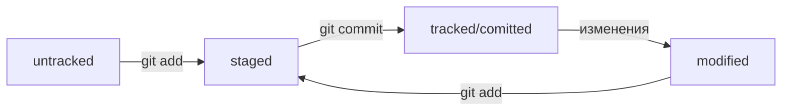

# git-tricks

Сам по себе Git предназначен для работы локально
GitHub, GitLab, GitBucket и прочие - удаленные репозитории для загрузки на сервер для работы в команде

## _Команды Git_:
- ```git init``` позволяет инициализировать папку .git 
- ```git log``` показывает историю изменений репозитория git
- ```git status``` отображает текущий статус репозитория, отображает любые модификации файлов
- ```git add``` говорит git`у, чтобы подготовил файл(ы) к фиксации (индексация)
   ```git add --all``` индексирует все файлы в текущей папке
- ```git commit -m "Some message"``` фиксирует текущее состояние репозитория с сообщением о внесенных изменениях
- ```git push``` отправляет commit`ы на удаленный сервер
- ```git remote``` отображает связанные удаленные сервера для текущего репозитория
- ```pwd``` отобразить текущую рабочую директорию (print working directory)
- ```cd``` используется для навигации по директориям (если требуется указать путь с пробелами в названии, необходимо заключить путь в двойные кавычки)
- ```~``` используется для обозначения домашней директории
- ```/``` используется для обозначения корневой директории
- ```..``` используется для того, чтобы выполнить действие с папкой на шаг назад
- ```ls``` отобразить файлы в директории
- ```cat``` отобразить содержимое файла на экране (работает только для текстовых файлов)
- ```mv``` предназначен для перемещения файлов/папок
- ```cp``` предназначен для копирования файлов/папок
- ```rm``` предназначен для удаления файлов
- ```rmdir``` предназначен для удаления пустых папок
- ```rm -rf "directory_name"``` предназначен для папок и всего содержимого в них (rf - recursive force)
- ```touch``` предназначен для создания файлов

## _SSH_
Можно сгенерировать ключи с помощью разных систем шифрования, в результате получается пара ключей:
- публиччный (имеет расширение ```.pub```) - его можно распростанять (служит для шифрования данных)
- приватный ключ (без расширения) не предназначен для распространения (служит для дешифрации данных)


_Текст редактировался с использование разметки Markdown_

## _Хеш_
Хэш/хеш коммита позволяет идентифицировать коммит, его автора и содержимое закоммиченных файлов
Вся информация о хешах коммитов находится в папке .git (скрытая папка)

## _Лог_
```git log``` позволяет отобразить все коммиты проекта
Среди полей логов выделают:
* имя автора
* почта автора
* дата коммита
* комментарий к коммиту

```git log --oneline``` позволяет отобразить историю коммитов более компактно, при этом отображаются только сокращенный хеш коммита (автоматически усеченный, но при этом достаточный для однозначной идентификации) и комментарий к нему

## _HEAD_
Это служебный файл в папке ```.git```, который указывает на самый последний (новый) коммит
Этот файл содержит ссылку, перейдя по которой можно увидеть хеш
Если прочитать его командой ```cat``` и сравнить его хеш с хешем из команды ```git log```, то можно удостовериться в их идентичности
HEAD можео указывать вместо хеша коммита, когда требуется указать на последний выполненный коммит


## _Статусы файлов в Git_
* ```untracked``` означает, что файл не помечен для гита как отслеживаемый, то есть гит не следит за его изменениями
* ```staged``` (также indexed, cached) фаза, в нее файл попадает после выполнения команды ```git add```, после этого файл находится в списке файлов, которые войдут в коммит
* ```tracked``` статус файл получает в момент начала отслеживания (то есть после выполнения команды ```git add```), а также после каждой команды ```git commit```
* ```modified``` статус означает, что гит обнаружил изменения в файле в сравнении с предыдушей его версией

Важные замечания:
* если файл был помечен как ```staged``` и его снова изменить, то последние изменения не буду отражены в ```staged```, необходимо заного выполнить команду ```git add```


### Типичный жизненный цикл файла в Git


Команда ```git status``` отображает только следующие состояния файлов: ```untracked```, ```staged```, ```modified```


## _Оформление сообщений к коммитам_
При выполнении команды ```git log --oneline``` Git сокращает сообщение коммитов до 72 символов
В ообщении нужно описать что было сделано емко и четко, чтобы любой неведающий человек мог понять о чем идет речь в коммите

### _Стили оформления_
* Корпоративный
Коммит, написанный в таком стиле, обычно включает некоторый ID системы организации и планирования задачи (например, Jira), это позволяет связывать коммиты с трекером задач
* Conventional Commits (от англ. "Соглашение о коммитах")
Данный стиль обычно используется для Open Source репозиториев
Используется следующий формат коммитов: ```<type>: <сообщение>```,
где ```<type>``` - тип изменений, например ```feat``` для нового функционала, ```fix``` - для исправления ошибок (более подробно [здесь](https://www.conventionalcommits.org/ru/v1.0.0-beta.4/#%D1%81%D0%BF%D0%B5%D1%86%D0%B8%D1%84%D0%B8%D0%BA%D0%B0%D1%86%D0%B8%D1%8F "Conventional Commits"))
```git commit -m "feat: добавить подсчёт суммы заказов за неделю" ```

* GitHub-стиль
Если проект решает или закрывает какую-либо задачу, то в сообщении коммита можно указать ссылку на нее вот так ```#<номер задачи>```
```$ git commit -m "Исправить #334, добавить график температуры"```
Тогда GitHub свяжет коммит с задачей

Исторически сложилось, что при оформлении сообщений коммитов следует использоать инфинитив-форму глагола для коммитов на русском языке ```Добавить тесты для PipkaService```, и повелительное наклонение на английском ```Fix exit button```

*Будет плюсом, если все сообщения коммитов:*
- оформленыы в едином стиле
- легко читаются
- иформативны


## _Диаграмма в виде Mermaid-схемы_



## _Исправление коммита_
```git commit --ammend```
Данный флаг ``--amend``` работает только с последним коммитом (HEAD)

С флагом ```--amend``` команда ```commit``` не создаст новый коммит, а дополнит последний

Ключ ```--no-edit``` сообщает, что сообщение коммита изменять не нужно

Если трубется изменить комментарий к коммиту, то можно указать ```git commit --amend -m "Сообщение"```
При изменениях с помощью команды ```--amend``` хеш коммита тоже изменяется, т.к. может измениться время коммита и его содержание

Если при выполнении команды ```git commit --amend``` забыть написать ```-m "Сообщение"``` или ```--no-edit```, то Git предложить отредактировать сообщение с помощью одного из втсроенных редакторов (самые популярные *nano* и *Vim*)
